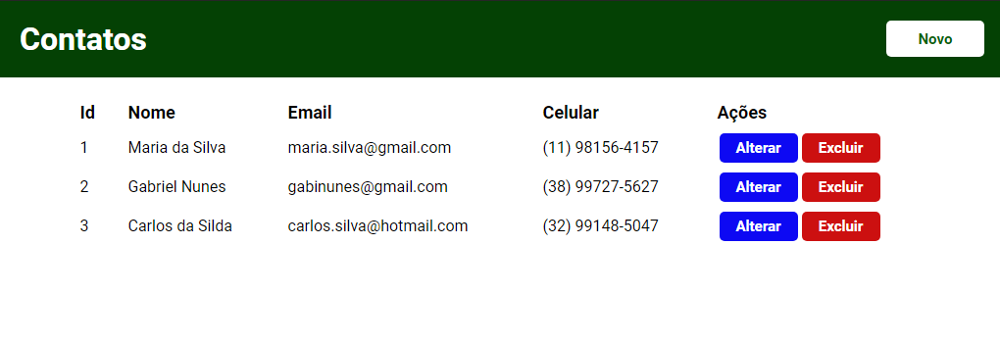
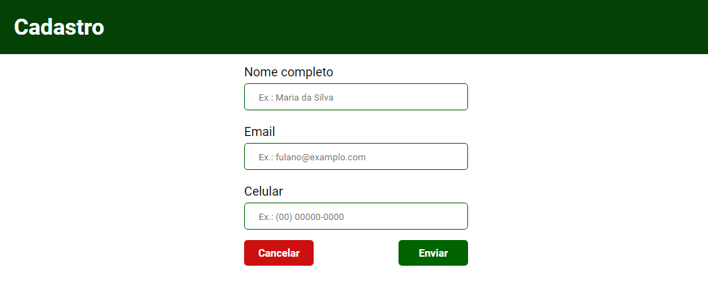

# CRUD Contatos

# Sobre
Desenvolvido com a finalidade de estudos

## Executar o projeto
- Necessario ter instalado
	- [MySQL](https://dev.mysql.com/downloads/)
	- [Node.js](https://nodejs.org/)
	- [Npm](https://www.npmjs.com/)
	> ``Obs.: É possivel instalar o npm junto com a instalação do node.js``

- Instalar dependências do projeto
	- ``npm install``

- Criar um database
	- ``CREATE DATABASE nomeDataBase;``

- Alterar o arquivo _'/src/models/db.js'_ e colocar os dados de configuração do seu banco de dado
	- Dados que devem ser alterados
		- ``database``
		- ``user``
		- ``password``

- Alterar o arquivo _'/src/models/Contato.js'_
	- Remover o comentario da linha
    	- ``Contato.sync({force: true});``
    	> Obs.: Após executar o projeto pela primeira vez, comentar novamente essa linha

- Executar o projeto
	- ``node src/index.js`` 
	- ``npm run dev`` (Executar com nodemon)

## Ferramentas utilizadas
- **Node.js**
- **Express**
- **Express-handlebars**
- **Sequelize**
- **Mysql**